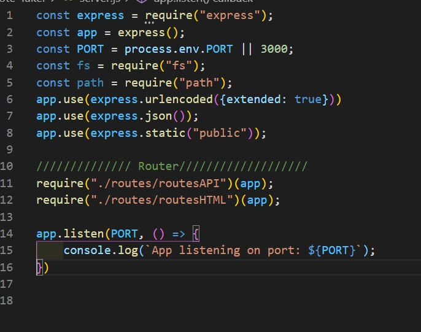
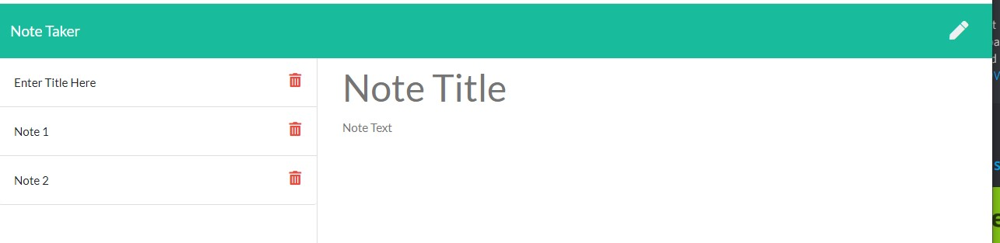
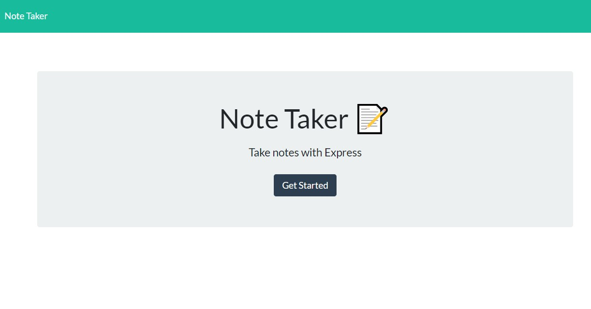

  # Note Taker

  

  # Description
  An application that can be used to write, save, and delete notes.

  #Table of Contents
  * [Installation](#installation)
  * [TableOfContents](#tableOfContents)
  * [Installation](#installation)
  * [Usage](#usage)
  * [Image](#image)
  * [Video](#video)
  * [License](#license)
  * [Tests](#tests)
  * [Questions](#questions)
  
  # Installation

  Must have the following installed: Node, express, app, port, fs, path

  
  # Usage

  Running on a local host, this application will run a webpage where a user can add notes with a Title.  
  
  The notes are saved into a file db.json with a unique ID.  The user can delete and edit notes as needed.

  
  # Images

  
  
  

  # Video
  Click the image below to watch the demo video!
  

  # License

  Shareware

  # Tests

  

  
  # Questions

  

  [Link to my GitHub](https://github.com/whiterice2020)

  If you have any quesitons, you can email me at github@delpadre.xyz

